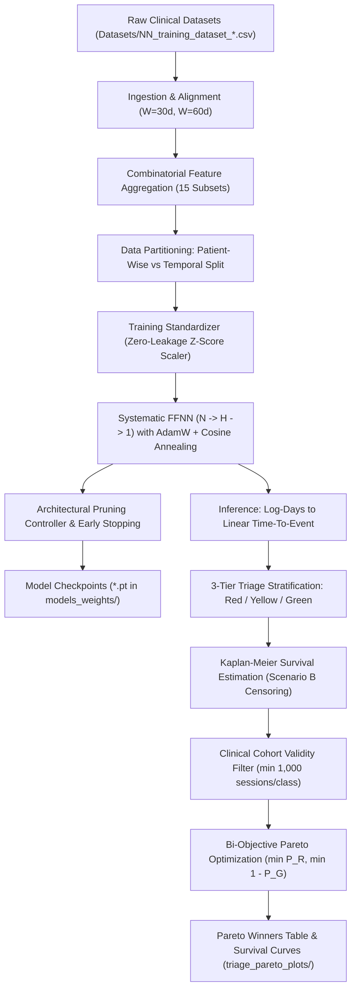

# Hemodialysis Time-To-Event (TTE) Prediction & Clinical Triage Pipeline

[](https://www.python.org/)
[](https://pytorch.org/)
[]()
[]()

A comprehensive deep learning framework for survival prediction, longitudinal risk stratification, and automated clinical triage in chronic hemodialysis patients using **Feed-Forward Neural Networks (FFNN)**, non-parametric **Kaplan-Meier survival analysis**, and **bi-objective Pareto frontier optimization**.

---

## Table of Contents
1. [Executive Summary](#executive-summary)
2. [End-to-End Pipeline Architecture](#end-to-end-pipeline-architecture)
3. [Clinical Feature Domains & Combinatorics](#clinical-feature-domains--combinatorics)
4. [Experimental Configurations](#experimental-configurations)
5. [Neural Architecture & Training Protocol](#neural-architecture--training-protocol)
6. [Clinical Triage & Kaplan-Meier Survival Analysis](#clinical-triage--kaplan-meier-survival-analysis)
7. [Constrained Multi-Objective Pareto Optimization](#constrained-multi-objective-pareto-optimization)
8. [Key Empirical Results & Winner Summary](#key-empirical-results--winner-summary)
9. [Project Directory Structure](#project-directory-structure)
10. [Installation & Execution Guide](#installation--execution-guide)

---

## Executive Summary

In end-stage renal disease (ESRD) patients undergoing chronic maintenance hemodialysis, anticipating adverse critical events (vascular access occlusion/infection, urgent hospitalization, and cardiovascular or all-cause mortality) is paramount for timely clinical intervention.

This project delivers an end-to-end machine learning system that:
* **Systematically interrogates multimodal clinical domains:** Integrates 4 core clinical areas (Vascular Access, Anemia & Iron Metabolism, Mineral & Bone Disorders, and Nutrition/PEW) across all **15 non-empty combinations**.
* **Explores dual longitudinal horizons:** Benchmarks baseline historical windows of **$W = 30$** and **$W = 60$** calendar days, alongside both **360-day administrative censoring** and **uncapped** longitudinal follow-up.
* **Evaluates realistic clinical deployment regimes:** Evaluates both **patient-wise splitting** (cross-patient generalization) and **temporal splitting** (prospective future forecasting per patient).
* **Solves a clinical triage trade-off:** Automatically stratifies patients into **High-Risk (Red < 180d)**, **Intermediate (Yellow 180–360d)**, and **Low-Risk (Green $\ge$ 360d)** tiers, optimizing the Pareto trade-off between **underestimating acute failure** ($P_R$) and **false positive over-alarm** ($1 - P_G = \bar{P}_G$).
* **Enforces non-parametric survival validation:** Employs rigorous Kaplan-Meier curves with right-censoring (Scenario B at 360 days) to evaluate survival dynamics across over 600 trained architectures.

---

## End-to-End Pipeline Architecture



---

## Clinical Feature Domains & Combinatorics

The dataset originates from longitudinal session records in the SIATE clinical datalake, mapped into 4 distinct clinical domains:

| Domain | Key | Features | Primary Clinical Biomarkers & Scope |
| :--- | :---: | :---: | :--- |
| **Accesso Vascolare (AV)** | `AV` | **26** | Dynamic arterial and venous dialysis pressures (`Arter`, `Vena`), vascular access scores (`Score CVC`, `Score FAV`), blood flow parameters (`QB Medio`, `QB Totale`, `QB`), blood pressure ratios (`PA/QB`, `PV/QB`, `A/V`), access maturity (`Mesi CVC`, `Mesi FAV`), and ultrafiltration (`UF`, `UF Tot`, `Ore Dialisi`, `Minuti Dialisi`). |
| **Anemia** | `Anemia` | **8** | Iron homeostasis, erythropoiesis, and ESA therapy: Hemoglobin (`Hb`), Ferritin (`Ferritina`), Serum Iron (`Sideremia`), Transferrin (`Transferrina`), Monthly Epoetin Alpha Dosage, weight-normalized dose (`Alpha EPODose Weight`), Erythropoietin Resistance Index (`Alpha ERI`), and Transferrin Saturation (`TSAT`). |
| **Metabolismo (CKD-MBD)** | `Metabolismo` | **7** | Chronic Kidney Disease-Mineral and Bone Disorder: Serum Calcium (`Calcemia`), Phosphorus (`Fosforemia`), Parathyroid Hormone (`PTH`), Alkaline Phosphatase (`Fosfatasi Alcalina`), Vitamin D (`Vitamina D`), Serum Bicarbonate (`Bicarbonatemia`), and the Phospho-Calcic Index (`FosfAlcIndex`). |
| **Nutrizione** | `Nutrizione` | **11** | Protein-Energy Wasting (PEW) and bioimpedance: Serum Albumin (`Albuminemia`), Cholesterol (`Colesterolemia`), Mid-Arm Circumference (`Circonferenza Braccio`), Daily Energy Intake (`DEI`), Daily Protein Intake (`DPI`), Body Mass Index (`BMI`), Body Cell Mass (`BCM post`), Fat-Free Mass (`FFM post`), Fat Mass (`FM post`), and Pre/Post Dialysis BUN (`Azotemia Pre`, `Azotemia Post`). |

### The 15 Combinatorial Feature Subsets:
* **Single Domain (4):** `AV` (26), `Anemia` (8), `Metabolismo` (7), `Nutrizione` (11)
* **Two Domains (6):** `AV+Anemia` (34), `AV+Metabolismo` (33), `AV+Nutrizione` (37), `Anemia+Metabolismo` (15), `Anemia+Nutrizione` (19), `Metabolismo+Nutrizione` (18)
* **Three Domains (4):** `AV+Anemia+Metabolismo` (41), `AV+Anemia+Nutrizione` (45), `AV+Metabolismo+Nutrizione` (44), `Anemia+Metabolismo+Nutrizione` (26)
* **All Four Domains (1):** `AV+Anemia+Metabolismo+Nutrizione` (52 aggregated features)

---

## Experimental Configurations

The pipeline benchmarks all combinations across a multidimensional grid:

### 1. Longitudinal Observation Windows ($W$)
* **$W = 30$ calendar days:** A session is admitted only if the patient has a historical track record of at least 30 calendar days from their first recorded dialysis session.
* **$W = 60$ calendar days:** Requires at least 60 calendar days of observed history, filtering out unstable initial hemodialysis initiation phases.

### 2. Time-To-Event Target Formulations
* **Capped Horizon (`capped360`):** Target values clamped at 360 days: $TTE_{\text{capped}} = \min(360, TTE_{\text{uncapped}})$. Reflects the standard 1-year clinical follow-up protocol.
* **Uncapped Horizon (`uncapped`):** Target represents the unconstrained calendar days to the next critical event.

### 3. Data Partitioning Regimes
* **`split_patient` (Patient-wise Split):** 50% train, 10% validation, 40% test by randomly grouping unique patient IDs. Evaluates model generalizability across previously unseen clinical subjects.
* **`split_temporal` (Temporal Split):** 50% earliest sessions train, 10% middle validation, 40% latest test for each individual patient. Reflects prospective chronological deployment in clinical practice.

---

## Neural Architecture & Training Protocol

```
Input x (N dims) ──> [Linear N -> H] ──> [LayerNorm] ──> [ReLU] ──> [Dropout(0.20)] ──> [Linear H -> 1] ──> Predicted log(TTE)
```

### Architectural Specifications:
* **Bottleneck Exploration:** Hidden dimension $H \in \{1, 2, 3, 5, 8, 16, 32, 64, 128\} \cap \{h \le N\}$, systematically testing extreme compression ($H=1, 2$) up to full capacity ($H=N$).
* **Noise Injection:** Gaussian perturbation ($\sigma = 0.03$) injected during training to prevent co-adaptation on repeated clinical session readings.
* **Loss Function:** PyTorch `SmoothL1Loss(beta=0.1)` on log-TTE space, dampening gradient volatility from extreme survival outliers:
  $$\mathcal{L}(y, \hat{y}) = \begin{cases} 0.5 (y - \hat{y})^2 / 0.1 & \text{if } |y - \hat{y}| < 0.1 \\ |y - \hat{y}| - 0.05 & \text{otherwise} \end{cases}$$
* **Optimizer & Scheduler:** `AdamW` (learning rate $4 \times 10^{-4}$, weight decay $2 \times 10^{-2}$) with `CosineAnnealingLR` (minimum $\eta_{\min} = 10^{-6}$, 1000 max epochs).
* **Early Stopping & Pruning:** 40-epoch patience on validation MAE. Automated architectural expansion controller halts wider hidden layers if the $|\text{Val}_{\text{MAE}} - \text{Train}_{\text{MAE}}|$ generalization gap exceeds 35 days or expands abruptly.

---

## Clinical Triage & Kaplan-Meier Survival Analysis

For each test session, the model's prediction $\hat{T} = \exp(\hat{y}_{\log})$ maps the patient into a clinical triage class:

```
                  180 Days               360 Days
    |---------------|-----------------------|----------------------->
       RED CLASS           YELLOW CLASS            GREEN CLASS
      (High Risk)         (Medium Risk)            (Low Risk)
     Pred < 180 d        180 <= Pred < 360 d       Pred >= 360 d
```

### Kaplan-Meier Non-Parametric Estimator
For each triage cohort, the empirical survival function $S(t) = P(T > t)$ is estimated under Scenario B administrative right-censoring:

$$S(t) = \prod_{t_i \le t} \left( 1 - \frac{d_i}{n_i} \right)$$

where $d_i$ is the number of critical events at time $t_i$ and $n_i$ is the number of patients at risk.

### Clinical Metrics & Trade-offs:
1. **$P_R = S_{\text{Red}}(180)$ (False Survival Rate at 180 days in Red Class):**
   * Probability that a patient categorized as High-Risk survives past 180 days without complication.
   * **Clinical Goal:** $\min P_R \to 0.0$ (High positive predictive value for acute failure).
2. **$P_G = S_{\text{Green}}(360)$ (True Event-Free Rate at 360 days in Green Class):**
   * Probability that a patient classified as Safe/Green remains event-free throughout the full 1-year window.
   * **Clinical Goal:** $\max P_G \to 1.0$.
3. **$\bar{P}_G = 1 - P_G$ (False Negative Rate in Green Class):**
   * Probability of an unpredicted critical failure occurring in the green safe tier.
   * **Clinical Goal:** $\min \bar{P}_G \to 0.0$.
4. **Upstream Cohort Gate (Minimum Sample Constraint):**
   * Any model with fewer than **1,000 test sessions** in Red, Yellow, or Green is marked `FILTERED` and excluded from Pareto consideration to prevent trivial classification collapse.

---

## Constrained Multi-Objective Pareto Optimization

The selection of the overall optimal model is formulated as a bi-objective minimization problem against the **Ideal Utopia Point** $(0, 0)$:

$$\min_{\theta} \quad \mathbf{F}(\theta) = \left( \bar{P}_G(\theta), \; P_R(\theta) \right)$$

$$\text{subject to } \min\left( N_{\text{Red}}, N_{\text{Yellow}}, N_{\text{Green}} \right) \ge 1000$$

A configuration $\mathbf{A}$ dominates $\mathbf{B}$ ($\mathbf{A} \prec \mathbf{B}$) if:
$$\bar{P}_G(\mathbf{A}) \le \bar{P}_G(\mathbf{B}) \quad \text{and} \quad P_R(\mathbf{A}) \le P_R(\mathbf{B}) \quad \text{with at least one strict inequality.}$$

The Euclidean distance to Utopia ($D_{\text{Ideal}}$) determines the winner:
$$D_{\text{Ideal}} = \sqrt{\bar{P}_G^2 + P_R^2}$$

---

## Key Empirical Results & Winner Summary

Across all 600+ trained models, below are the winning Pareto models for each of the 15 feature group combinations (extracted from `pareto_winners_comparison.csv`):

| Rank | Model # | Feature Combination | $W$ | Target | Split | Inputs ($N$) | Hidden ($H$) | $P_R \downarrow$ | $P_G \uparrow$ | $\bar{P}_G \downarrow$ | $D_{\text{Ideal}} \downarrow$ | Test MAE | Global Pareto? |
| :---: | :---: | :--- | :---: | :---: | :---: | :---: | :---: | :---: | :---: | :---: | :---: | :---: | :---: |
| **1** | **#580** | **AV + Anemia + Nutrizione** | **60d** | **capped360** | **temporal** | **45** | **45** | **0.1499** | **0.8497** | **0.1503** | **0.2123** | **97.5d** | **YES** |
| 2 | #94 | AV + Nutrizione | 30d | capped360 | temporal | 37 | 37 | 0.1554 | 0.8202 | 0.1798 | 0.2376 | 99.8d | - |
| 3 | #626 | AV + Anemia + Metabolismo + Nutrizione | 60d | capped360 | temporal | 52 | 52 | 0.1634 | 0.8171 | 0.1829 | 0.2453 | 93.9d | - |
| 4 | #78 | AV + Metabolismo | 30d | capped360 | temporal | 33 | 33 | 0.1924 | 0.8030 | 0.1970 | 0.2754 | 116.4d | - |
| 5 | #181 | AV + Metabolismo + Nutrizione | 30d | capped360 | temporal | 44 | 32 | 0.1741 | 0.7802 | 0.2198 | 0.2804 | 99.1d | - |
| 6 | #61 | AV + Anemia | 30d | capped360 | temporal | 34 | 32 | 0.1546 | 0.7412 | 0.2588 | 0.3015 | 113.7d | - |
| 7 | #149 | AV + Anemia + Metabolismo | 30d | capped360 | temporal | 41 | 32 | 0.1880 | 0.7333 | 0.2667 | 0.3263 | 114.8d | - |
| 8 | #189 | Anemia + Metabolismo + Nutrizione | 30d | capped360 | patient | 26 | 26 | 0.2600 | 0.7808 | 0.2192 | 0.3401 | 84.5d | - |
| 9 | #527 | Anemia + Nutrizione | 60d | capped360 | patient | 19 | 19 | 0.2552 | 0.7226 | 0.2774 | 0.3769 | 83.7d | - |
| 10 | #250 | Nutrizione | 30d | uncapped | patient | 11 | 8 | 0.2083 | 0.6704 | 0.3296 | 0.3899 | 208.3d | - |
| 11 | #344 | Metabolismo + Nutrizione | 30d | uncapped | temporal | 18 | 16 | 0.1417 | 0.6234 | 0.3766 | 0.4024 | 189.4d | - |
| 12 | #428 | AV (Accesso Vascolare solo) | 60d | capped360 | temporal | 26 | 26 | 0.2268 | 0.6425 | 0.3575 | 0.4234 | 117.7d | - |
| 13 | #317 | Anemia + Metabolismo | 30d | uncapped | temporal | 15 | 15 | 0.1829 | 0.5561 | 0.4439 | 0.4801 | 193.3d | - |
| 14 | #235 | Anemia (solo) | 30d | uncapped | temporal | 8 | 8 | 0.1904 | 0.5483 | 0.4517 | 0.4902 | 190.2d | - |
| 15 | #239 | Metabolismo (solo) | 30d | uncapped | patient | 7 | 5 | 0.4350 | 0.5923 | 0.4077 | 0.5962 | 232.6d | - |

### Key Clinical Insights:
* **The Champion Triplet:** **Model #580 (`AV + Anemia + Nutrizione`)** achieves superior performance with $D = 0.2123$. In the high-risk Red cohort, **$85.0\%$** of patients suffer acute events prior to 180 days ($P_R = 14.99\%$). In the low-risk Green cohort, **$85.0\%$** remain complication-free throughout the entire year ($P_G = 84.97\%$).
* **The Synergy of Nutrition & Vascular Access:** Every top-5 configuration integrates both Vascular Access (`AV`) and Nutrition (`Nutrizione`), confirming the pathophysiological link between Protein-Energy Wasting, vascular inflammation, and access patency.
* **Window Superiority:** An observation window of $W=60$ days combined with the 360-day capped target provides optimal signal stability for acute event forecasting.

---

## Project Directory Structure

```
c:\Users\vince\Desktop\NN\
├── FFNN.py                                 # Master pipeline execution script
├── Datasets/                               # Raw longitudinal CSV datasets & metadata
│   ├── NN_training_dataset_W30_*.csv       # W=30 datasets (AV, Anemia, Nutrizione, etc.)
│   ├── NN_training_dataset_W60_*.csv       # W=60 datasets
│   └── patient_age.json                    # Demographics mapping: Patient ID -> Age (years)
├── final_combinatorial_ffnn_pareto_results.csv # Master database log of all 600+ trained models
├── pareto_winners_comparison.csv           # Benchmark comparison of winning Pareto models
├── models_weights/                         # Checkpoints of trained PyTorch models (*.pt)
│   └── Model_{num}_{id}.pt
├── triage_pareto_plots/                    # High-resolution clinical visualizations
│   ├── KM_Model_{num}_{id}.png             # 3-tier Kaplan-Meier survival curves per model
│   ├── global_pareto_frontier_numbered.png # Global Pareto frontier with labelled winners
│   └── pareto_winners_comparison.png       # Winner comparison chart across subset sizes
└── README.md                               # Project documentation
```

---

## Installation & Execution Guide

### 1. Environment Setup
Requires Python 3.10+ or 3.11+ and PyTorch (CUDA acceleration enabled automatically if available):

```bash
# Clone or navigate to the repository
cd c:\Users\vince\Desktop\NN

# Install dependencies
pip install torch numpy pandas matplotlib
```

### 2. Execution
Run the end-to-end combinatorial training, evaluation, and plotting pipeline:

```bash
python FFNN.py
```

### 3. Pipeline Output
During execution, the script:
1. Validates file presence in `Datasets/` and loads patient age metadata.
2. Ingests and standardizes each feature combination.
3. Trains FFNN models with cosine annealing and logs real-time train/val/test performance.
4. Executes Kaplan-Meier survival estimations across test triage classes.
5. Saves model weights to `models_weights/`.
6. Generates individual Kaplan-Meier curves and Pareto frontier plots in `triage_pareto_plots/`.
7. Exports `final_combinatorial_ffnn_pareto_results.csv` and `pareto_winners_comparison.csv`.
