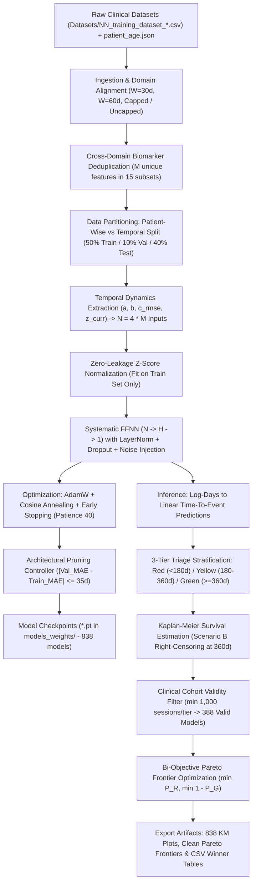

# Hemodialysis Time-To-Event (TTE) Prediction & Clinical Triage Pipeline

[](https://www.python.org/)
[](https://pytorch.org/)
[]()
[]()
[]()

A comprehensive deep learning framework for survival prediction, longitudinal risk stratification, and automated clinical triage in chronic hemodialysis patients using **Feed-Forward Neural Networks (FFNN)** with **temporal dynamics feature extraction $(a, b, c, z)$**, non-parametric **Kaplan-Meier survival analysis**, and **bi-objective Pareto frontier optimization**.

---

## Table of Contents
1. [Executive Summary](#executive-summary)
2. [End-to-End Pipeline Architecture](#end-to-end-pipeline-architecture)
3. [Clinical Feature Domains, Deduplication & Dynamics Extraction](#clinical-feature-domains-deduplication--dynamics-extraction)
4. [Experimental Configurations](#experimental-configurations)
5. [Neural Architecture & Training Protocol](#neural-architecture--training-protocol)
6. [Clinical Triage & Kaplan-Meier Survival Analysis](#clinical-triage--kaplan-meier-survival-analysis)
7. [Constrained Multi-Objective Pareto Optimization](#constrained-multi-objective-pareto-optimization)
8. [Key Empirical Results & Winner Summary](#key-empirical-results--winner-summary)
   - [Summary of 15 Winning Models Across Combinations](#summary-of-15-winning-models-across-combinations)
   - [The 6 Non-Dominated Global Pareto Frontier Models](#the-6-non-dominated-global-pareto-frontier-models)
   - [Key Clinical & Methodological Insights](#key-clinical--methodological-insights)
9. [Project Directory Structure](#project-directory-structure)
10. [Installation & Execution Guide](#installation--execution-guide)

---

## Executive Summary

In end-stage renal disease (ESRD) patients undergoing chronic maintenance hemodialysis, anticipating adverse critical events (vascular access occlusion/infection, urgent hospitalization, cardiovascular collapse, and all-cause mortality) is paramount for timely clinical intervention and resource allocation.

This project delivers an end-to-end machine learning system that:
* **Systematically interrogates multimodal clinical domains:** Integrates 4 core clinical areas (Vascular Access, Anemia & Iron Metabolism, Mineral & Bone Disorders, and Nutrition/PEW) across all **15 non-empty combinations**, enforcing **strict cross-domain deduplication** of shared biomarkers.
* **Transforms longitudinal series into temporal dynamics $(a, b, c_{\text{rmse}}, z_{\text{curr}})$:** Rather than using raw static observations, the pipeline fits linear trajectories over historical sliding windows to capture trend rate ($a$), baseline level ($b$), residual physiological instability/volatility ($c_{\text{rmse}}$), and instantaneous measurements ($z_{\text{curr}}$), expanding $M$ unique biomarkers into $N = 4 \times M$ input dimensions.
* **Explores dual longitudinal horizons:** Benchmarks baseline historical observation windows of **$W = 30$** and **$W = 60$** calendar days, alongside both **360-day administrative censoring** (`capped360`) and **uncapped** longitudinal follow-up.
* **Evaluates realistic clinical deployment regimes:** Evaluates both **patient-wise splitting** (cross-patient generalization on unseen cohorts) and **temporal splitting** (prospective future forecasting per patient).
* **Solves a clinical triage trade-off:** Automatically stratifies patients into **High-Risk (Red $< 180$d)**, **Intermediate (Yellow $180–360$d)**, and **Low-Risk (Green $\ge 360$d)** tiers, optimizing the Pareto trade-off between **underestimating acute failure** ($P_R$) and **false positive over-alarm** ($1 - P_G = \bar{P}_G$).
* **Enforces non-parametric survival validation:** Employs rigorous Kaplan-Meier curves with right-censoring (Scenario B at 360 days) to evaluate survival dynamics across **838 systematically trained architectures**, enforcing an upstream cohort validity gate ($\min(N_{\text{Red}}, N_{\text{Yellow}}, N_{\text{Green}}) \ge 1,000$ test sessions) that retains **388 clinically valid** models and isolates **6 non-dominated Global Pareto frontier champions**.

---

## End-to-End Pipeline Architecture



---

## Clinical Feature Domains, Deduplication & Dynamics Extraction

The dataset originates from longitudinal hemodialysis records in the SIATE clinical datalake, mapped into 4 distinct clinical domains:

| Domain | Key | Raw Measures ($M$) | Primary Clinical Biomarkers & Scope |
| :--- | :---: | :---: | :--- |
| **Accesso Vascolare (AV)** | `AV` | **26** | Dynamic arterial and venous dialysis pressures (`Arter`, `Vena`), vascular access scores (`Score CVC`, `Score FAV`), blood flow parameters (`QB Medio`, `QB Totale`, `QB`), blood pressure ratios (`PA/QB`, `PV/QB`, `A/V`), access maturity (`Mesi CVC`, `Mesi FAV`), and ultrafiltration (`UF`, `UF Tot`, `Ore Dialisi`, `Minuti Dialisi`). |
| **Anemia** | `Anemia` | **8** | Iron homeostasis, erythropoiesis, and ESA therapy: Hemoglobin (`Hb`), Ferritin (`Ferritina`), Serum Iron (`Sideremia`), Transferrin (`Transferrina`), Monthly Epoetin Alpha Dosage, weight-normalized dose (`Alpha EPODose Weight`), Erythropoietin Resistance Index (`Alpha ERI`), and Transferrin Saturation (`TSAT`). |
| **Metabolismo (CKD-MBD)** | `Metabolismo` | **7** | Chronic Kidney Disease-Mineral and Bone Disorder: Serum Calcium (`Calcemia`), Phosphorus (`Fosforemia`), Parathyroid Hormone (`PTH`), Alkaline Phosphatase (`Fosfatasi Alcalina`), Vitamin D (`Vitamina D`), Serum Bicarbonate (`Bicarbonatemia`), and the Phospho-Calcic Index (`FosfAlcIndex`). |
| **Nutrizione** | `Nutrizione` | **11** | Protein-Energy Wasting (PEW) and bioimpedance: Serum Albumin (`Albuminemia`), Cholesterol (`Colesterolemia`), Mid-Arm Circumference (`Circonferenza Braccio`), Daily Energy Intake (`DEI`), Daily Protein Intake (`DPI`), Body Mass Index (`BMI`), Body Cell Mass (`BCM post`), Fat-Free Mass (`FFM post`), Fat Mass (`FM post`), and Pre/Post Dialysis BUN (`Azotemia Pre`, `Azotemia Post`). |

### 1. Cross-Domain Biomarker Deduplication
When aggregating clinical domains, identical parameters shared across datasets (identified by standardized column name or exact numerical equivalence) are deduplicated so that each biological biomarker enters the feature extraction pipeline **exactly once**:

| Feature Combination | Domain Count | Unique Measures ($M$) | Input Dimensions ($N = 4 \times M$) | Overlap Deduplicated |
| :--- | :---: | :---: | :---: | :---: |
| **Metabolismo** | 1 | **7** | **28** | - |
| **Anemia** | 1 | **8** | **32** | - |
| **Nutrizione** | 1 | **11** | **44** | - |
| **AV** | 1 | **26** | **104** | - |
| **Anemia + Metabolismo** | 2 | **15** | **60** | 0 |
| **Metabolismo + Nutrizione** | 2 | **18** | **72** | 0 |
| **Anemia + Nutrizione** | 2 | **19** | **76** | 0 |
| **AV + Nutrizione** | 2 | **31** | **124** | 6 overlapping biomarkers |
| **AV + Metabolismo** | 2 | **32** | **128** | 1 overlapping biomarker |
| **AV + Anemia** | 2 | **33** | **132** | 1 overlapping biomarker |
| **Anemia + Metabolismo + Nutrizione** | 3 | **26** | **104** | 0 |
| **AV + Metabolismo + Nutrizione** | 3 | **37** | **148** | 7 overlapping biomarkers |
| **AV + Anemia + Nutrizione** | 3 | **38** | **152** | 7 overlapping biomarkers |
| **AV + Anemia + Metabolismo** | 3 | **39** | **156** | 2 overlapping biomarkers |
| **AV + Anemia + Metabolismo + Nutrizione** | 4 | **44** | **176** | 8 overlapping biomarkers |

### 2. Temporal Dynamics Feature Extraction: $(a, b, c_{\text{rmse}}, z_{\text{curr}})$
For each unique clinical measure $m \in \{1, \dots, M\}$ across a historical window of $W$ sessions ($t = 0, \dots, W-1$), the pipeline extracts four parameters:
1. **$a$ (Longitudinal Slope / Rate of Change):**
   $$a = \frac{\sum_{t=0}^{W-1} (t - \bar{t})(X_t - \bar{X})}{\sum_{t=0}^{W-1} (t - \bar{t})^2}, \quad \text{where } \bar{t} = \frac{W-1}{2}$$
2. **$b$ (Center Intercept / Baseline Level):**
   $$b = \bar{X} - a \bar{t}$$
3. **$c_{\text{rmse}}$ (Instability / Physiological Volatility):**
   $$c_{\text{rmse}} = \sqrt{\frac{1}{W} \sum_{t=0}^{W-1} \left(X_t - (a t + b)\right)^2}$$
4. **$z_{\text{curr}}$ (Instantaneous Current Reading):**
   $$z_{\text{curr}} = X_{W-1}$$

This expansion transforms the static snapshot into a **dynamic trajectory representation**, resulting in an input dimensionality of:
$$N = 4 \times M_{\text{unique}}$$

---

## Experimental Configurations

The systematic combinatorial search benchmarks all configurations across a multidimensional grid:

### 1. Longitudinal Observation Windows ($W$)
* **$W = 30$ calendar days:** Requires at least 30 calendar days of recorded history from first dialysis session.
* **$W = 60$ calendar days:** Requires at least 60 calendar days of observed history, filtering out acute initiation transients.

### 2. Time-To-Event Target Formulations
* **Capped Horizon (`capped360`):** Target values clamped at 360 days: $TTE_{\text{capped}} = \min(360, TTE_{\text{uncapped}})$, with log-space training saturation at 400 days. Reflects standard 1-year clinical follow-up protocol.
* **Uncapped Horizon (`uncapped`):** Target represents the unconstrained calendar days to next critical event.

### 3. Data Partitioning Regimes
* **`split_patient` (Patient-wise Split):** 50% train, 10% validation, 40% test grouped by unique patient IDs. Evaluates model generalizability across completely unseen clinical subjects.
* **`split_temporal` (Temporal Split):** 50% earliest sessions train, 10% middle validation, 40% latest test chronologically per patient. Evaluates prospective clinical deployment over time.

### 4. Demographic Tracking
Patient age metadata ([patient_age.json](file:///c:/Users/vince/Desktop/NN/Datasets/patient_age.json)) is mapped to each session. Demographic distributions (`Age_Red`, `Age_Yellow`, `Age_Green`, `Age_Total`) are tracked across predicted risk tiers to monitor and prevent triage age bias.

---

## Neural Architecture & Training Protocol

```
Input x (N dims) ──> [Linear N -> H] ──> [LayerNorm] ──> [ReLU] ──> [Dropout(0.20)] ──> [Linear H -> 1] ──> Predicted log(TTE)
```
*(Note: For extreme compression $H=1$, LayerNorm is omitted to maintain gradient flow: `Linear N -> 1 -> ReLU -> Dropout -> Linear 1 -> 1`)*

### Architectural Specifications:
* **Hidden Unit Exploration ($H$):** Dynamic search over candidate bottlenecks:
  $$H \in \{1, 2, 3, 5, 8, 16, 32, 64, 128\} \cap \{h < N\} \cup \{N\}$$
  evaluating extreme compression ($H=1, 2$) up to full capacity ($H=N$).
* **Noise Injection:** Gaussian perturbation ($\sigma = 0.03$) injected during training to prevent co-adaptation across repetitive sessions.
* **Loss Function:** PyTorch `SmoothL1Loss(beta=0.1)` on log-TTE space:
  $$\mathcal{L}(y, \hat{y}) = \begin{cases} 0.5 (y - \hat{y})^2 / 0.1 & \text{if } |y - \hat{y}| < 0.1 \\ |y - \hat{y}| - 0.05 & \text{otherwise} \end{cases}$$
* **Optimizer & Scheduler:** `AdamW` (learning rate $4 \times 10^{-4}$, weight decay $2 \times 10^{-2}$) with `CosineAnnealingLR` ($\eta_{\min} = 10^{-6}$, 1000 max epochs).
* **Early Stopping & Pruning:** 40-epoch patience on validation MAE. Architectural expansion controller halts wider hidden layers if the generalization gap $|\text{Val}_{\text{MAE}} - \text{Train}_{\text{MAE}}| > 35$ days or if severe overfitting emerges.

---

## Clinical Triage & Kaplan-Meier Survival Analysis

For each test session, the network's predicted time $\hat{T} = \exp(\hat{y}_{\log})$ stratifies the patient into a 3-tier clinical triage class:

```
                  180 Days               360 Days
    |---------------|-----------------------|----------------------->
       RED CLASS           YELLOW CLASS            GREEN CLASS
       (High Risk)         (Medium Risk)            (Low Risk)
      Pred < 180 d        180 <= Pred < 360 d       Pred >= 360 d
```

### Kaplan-Meier Non-Parametric Estimator
For each triage cohort, the empirical survival function $S(t) = P(T > t)$ is estimated under Scenario B right-censoring ($C = 360.0$ days):

$$S(t) = \prod_{t_i \le t} \left( 1 - \frac{d_i}{n_i} \right)$$

where $d_i$ is the number of events at time $t_i$ and $n_i$ is the number of patients at risk.

### Clinical Metrics & Trade-offs:
1. **$P_R = S_{\text{Red}}(180)$ (False Survival Rate at 180 days in Red Class):**
   * Proportion of patients classified as High-Risk who survive past 180 days without experiencing an acute event.
   * **Clinical Goal:** $\min P_R \to 0.0$ (High positive predictive value for acute failure; values below $0.20$ indicate $>80\%$ event rate).
2. **$P_G = S_{\text{Green}}(360)$ (True Event-Free Rate at 360 days in Green Class):**
   * Proportion of patients classified as Low-Risk who remain event-free through the full 1-year window.
   * **Clinical Goal:** $\max P_G \to 1.0$.
3. **$\bar{P}_G = 1 - P_G$ (False Negative Rate in Green Class):**
   * Proportion of Green-classified patients who suffer an unexpected critical failure within 360 days.
   * **Clinical Goal:** $\min \bar{P}_G \to 0.0$.
4. **Upstream Cohort Gate (Minimum Sample Constraint):**
   * Any model with fewer than **1,000 test sessions** in Red, Yellow, or Green is marked `FILTERED (< 1000)` and excluded from Pareto consideration, eliminating trivial classification collapse.
   * Across the 838 trained architectures, **388 models satisfied this strict gate**.

---

## Constrained Multi-Objective Pareto Optimization

The optimal model selection is formulated as a bi-objective minimization problem against the **Ideal Utopia Point** $(0, 0)$:

$$\min_{\theta} \quad \mathbf{F}(\theta) = \left( \bar{P}_G(\theta), \; P_R(\theta) \right)$$

$$\text{subject to } \min\left( N_{\text{Red}}, N_{\text{Yellow}}, N_{\text{Green}} \right) \ge 1000$$

A configuration $\mathbf{A}$ dominates $\mathbf{B}$ ($\mathbf{A} \prec \mathbf{B}$) if:
$$\bar{P}_G(\mathbf{A}) \le \bar{P}_G(\mathbf{B}) \quad \text{and} \quad P_R(\mathbf{A}) \le P_R(\mathbf{B}) \quad \text{with at least one strict inequality.}$$

The Euclidean distance to Ideal Utopia ($D_{\text{Ideal}}$) identifies the winning models:
$$D_{\text{Ideal}} = \sqrt{\bar{P}_G^2 + P_R^2}$$

---

## Key Empirical Results & Winner Summary

### Summary of 15 Winning Models Across Combinations
From the 838 trained models, the local Pareto winners for each of the 15 clinical feature combinations (extracted from [pareto_winners_comparison.csv](file:///c:/Users/vince/Desktop/NN/pareto_winners_comparison.csv)) are ranked below by distance to Utopia ($D_{\text{Ideal}}$):

| Rank | Model # | Feature Combination | $W$ | Target | Split | $M$ | $N$ | $H$ | Params | $P_R \downarrow$ | $P_G \uparrow$ | $\bar{P}_G \downarrow$ | $D_{\text{Ideal}} \downarrow$ | Test MAE | Global Pareto? |
| :---: | :---: | :--- | :---: | :---: | :---: | :---: | :---: | :---: | :---: | :---: | :---: | :---: | :---: | :---: | :---: |
| **1** | **#209** | **AV+Metabolismo+Nutrizione** | **30d** | **capped360** | **split_temporal** | 37 | 148 | 8 | 1,217 | 0.1793 | 0.8171 | 0.1829 | **0.2561** | 108.8d | **YES** |
| **2** | **#61** | **Nutrizione** | **30d** | **capped360** | **split_temporal** | 11 | 44 | 44 | 2,113 | 0.1397 | 0.7599 | 0.2401 | **0.2778** | 94.9d | **YES** |
| **3** | **#110** | **AV+Nutrizione** | **30d** | **capped360** | **split_temporal** | 31 | 124 | 32 | 4,097 | 0.1750 | 0.7657 | 0.2343 | **0.2924** | 93.7d | **YES** |
| **4** | **#246** | **AV+Anemia+Metabolismo+Nutrizione** | **30d** | **capped360** | **split_temporal** | 44 | 176 | 64 | 11,521 | 0.2228 | 0.7647 | 0.2353 | **0.3240** | 96.3d | - |
| **5** | **#194** | **AV+Anemia+Nutrizione** | **30d** | **capped360** | **split_temporal** | 38 | 152 | 32 | 4,993 | 0.1899 | 0.7359 | 0.2641 | **0.3253** | 97.0d | - |
| **6** | **#146** | **Anemia+Nutrizione** | **30d** | **capped360** | **split_temporal** | 19 | 76 | 76 | 6,081 | 0.1874 | 0.7265 | 0.2735 | **0.3315** | 96.3d | - |
| **7** | **#436** | **Anemia+Metabolismo+Nutrizione** | **30d** | **uncapped** | **split_temporal** | 26 | 104 | 104 | 11,233 | 0.1693 | 0.7025 | 0.2975 | **0.3423** | 157.5d | - |
| **8** | **#76** | **AV+Anemia** | **30d** | **capped360** | **split_temporal** | 33 | 132 | 32 | 4,353 | 0.2518 | 0.7590 | 0.2410 | **0.3485** | 110.5d | - |
| **9** | **#93** | **AV+Metabolismo** | **30d** | **capped360** | **split_temporal** | 32 | 128 | 32 | 4,225 | 0.2175 | 0.7161 | 0.2839 | **0.3576** | 111.9d | - |
| **10** | **#160** | **Metabolismo+Nutrizione** | **30d** | **capped360** | **split_temporal** | 18 | 72 | 16 | 1,217 | 0.1456 | 0.6715 | 0.3285 | **0.3593** | 103.5d | - |
| **11** | **#177** | **AV+Anemia+Metabolismo** | **30d** | **capped360** | **split_temporal** | 39 | 156 | 32 | 5,121 | 0.2762 | 0.7331 | 0.2669 | **0.3841** | 114.5d | - |
| **12** | **#15** | **AV** | **30d** | **capped360** | **split_temporal** | 26 | 104 | 32 | 3,457 | 0.2255 | 0.6666 | 0.3334 | **0.4025** | 113.0d | - |
| **13** | **#361** | **Anemia+Metabolismo** | **30d** | **uncapped** | **split_temporal** | 15 | 60 | 60 | 3,841 | 0.1940 | 0.5626 | 0.4374 | **0.4785** | 203.0d | - |
| **14** | **#277** | **Anemia** | **30d** | **uncapped** | **split_temporal** | 8 | 32 | 5 | 181 | 0.1462 | 0.5341 | 0.4659 | **0.4883** | 207.1d | - |
| **15** | **#707** | **Metabolismo** | **60d** | **uncapped** | **split_patient** | 7 | 28 | 16 | 513 | 0.3560 | 0.6256 | 0.3744 | **0.5166** | 201.3d | - |

---

### The 6 Non-Dominated Global Pareto Frontier Models
Among all 388 clinically valid architectures across the entire dataset, exactly **6 models** are non-dominated in the bi-objective space $(\bar{P}_G, P_R)$, forming the **Global Pareto Frontier**:

| Model # | Feature Combination | $W$ | Target | Split | $M$ | $N$ | $H$ | Params | $P_R \downarrow$ | $P_G \uparrow$ | $\bar{P}_G \downarrow$ | $D_{\text{Ideal}} \downarrow$ | Test MAE | Cohort Red / Yel / Grn |
| :---: | :--- | :---: | :---: | :---: | :---: | :---: | :---: | :---: | :---: | :---: | :---: | :---: | :---: | :---: |
| **#209** | **AV+Metabolismo+Nutrizione** | 30d | capped360 | split_temporal | 37 | 148 | 8 | 1,217 | 0.1793 | 0.8171 | 0.1829 | **0.2561** | 108.8d | 10,951 / 127,467 / 1,099 |
| **#61** | **Nutrizione** | 30d | capped360 | split_temporal | 11 | 44 | 44 | 2,113 | 0.1397 | 0.7599 | 0.2401 | **0.2778** | 94.9d | 20,446 / 117,713 / 1,358 |
| **#110** | **AV+Nutrizione** | 30d | capped360 | split_temporal | 31 | 124 | 32 | 4,097 | 0.1750 | 0.7657 | 0.2343 | **0.2924** | 93.7d | 23,007 / 113,988 / 2,522 |
| **#618** | **AV+Anemia+Nutrizione** | 60d | capped360 | split_patient | 38 | 152 | 16 | 2,497 | 0.3553 | 0.8401 | 0.1599 | **0.3896** | 82.3d | 18,835 / 81,895 / 1,563 |
| **#812** | **AV+Anemia+Nutrizione** | 60d | uncapped | split_temporal | 38 | 152 | 1 | 155 | 0.0953 | 0.6088 | 0.3912 | **0.4026** | 217.6d | 6,220 / 23,830 / 100,909 |
| **#404** | **AV+Anemia+Nutrizione** | 30d | uncapped | split_temporal | 38 | 152 | 1 | 155 | 0.0815 | 0.5867 | 0.4133 | **0.4213** | 232.9d | 4,501 / 21,377 / 113,639 |

---

### Key Clinical & Methodological Insights:
* **The Global Champion: Model #209 (`AV + Metabolismo + Nutrizione`):**
  * Achieves the closest overall Euclidean distance to Utopia ($D_{\text{Ideal}} = 0.2561$).
  * **High-Risk (Red Tier):** Only $17.93\%$ false survival rate ($P_R = 0.1793$), proving that **$> 82\%$** of patients flagged in Red suffer acute events within 180 days.
  * **Low-Risk (Green Tier):** **$81.71\%$** of patients classified as Green remain complication-free through the entire 360-day window ($P_G = 0.8171, \bar{P}_G = 0.1829$).
  * **Architectural Efficiency:** With an extreme bottleneck of $H=8$ hidden nodes (1,217 parameters), it compresses $N=148$ dynamic features without overfitting.
* **The Ubiquity of Nutrition as a Clinical Anchor:**
  * All top 6 winning configurations (and 7 of the top 8) incorporate `Nutrizione`. Single-domain `Nutrizione` (**Model #61**) achieves the second-best distance to Utopia ($D = 0.2778$) and is on the Global Pareto frontier.
  * This reinforces the clinical centrality of Protein-Energy Wasting (PEW), body composition loss, and hypoalbuminemia as major systemic drivers of mortality and cardiovascular failure in ESRD.
* **Cross-Patient Generalization Champion: Model #618:**
  * On the rigorous **patient-wise split** (`split_patient`), Model #618 achieves the lowest Green failure rate in the entire benchmark ($\bar{P}_G = 0.1599$, $P_G = 84.01\%$) and an exceptionally low Test MAE of $82.3$ days.
* **Extreme Acute Sensitivity: Models #812 & #404:**
  * Under uncapped formulations with an ultra-compact linear bottleneck ($H=1$, 155 parameters), these models achieve remarkable sensitivity to acute failure: $P_R = 0.0953$ and $P_R = 0.0815$, meaning **over $90\%$ of patients placed in the Red tier experience critical events before 180 days**.

---

## Project Directory Structure

```
c:\Users\vince\Desktop\NN\
├── FFNN.py                                      # Master end-to-end training, triage & Pareto pipeline
├── Datasets/                                    # Longitudinal CSV datasets and patient demographic metadata
│   ├── NN_training_dataset_W30_26_av_*.csv      # Vascular access datasets (W=30d, capped & uncapped)
│   ├── NN_training_dataset_W30_anemia_*.csv     # Anemia & iron metabolism datasets
│   ├── NN_training_dataset_W30_metabolismo_*.csv# CKD-MBD mineral metabolism datasets
│   ├── NN_training_dataset_W30_nutrizione_*.csv # PEW & bioimpedance nutrition datasets
│   ├── NN_training_dataset_W60_*.csv            # W=60d longitudinal datasets across all domains
│   └── patient_age.json                         # Patient ID to age mapping metadata
├── final_combinatorial_ffnn_pareto_results.csv  # Comprehensive database of all 838 trained architectures
├── pareto_winners_comparison.csv                # Benchmark comparison of winning models across 15 combinations
├── models_weights/                              # PyTorch checkpoints of all 838 trained architectures (*.pt)
│   ├── Model_209_AV+Metabolismo+Nutrizione_W30_H8_capped360_split_temporal.pt
│   └── Model_{num}_{id}.pt
├── triage_pareto_plots/                         # Visual artifacts and publication plots
│   ├── KM_Model_{num}_{id}.png                  # 3-tier Kaplan-Meier survival curves for each evaluated model
│   ├── global_pareto_frontier_0_6_perfect_english.png # Global Pareto frontier plot (clinically valid models)
│   └── pareto_winners_comparison.png            # Multi-objective comparison chart across feature combinations
└── README.md                                    # Project documentation
```

---

## Installation & Execution Guide

### 1. Environment Setup
Requires Python 3.10+ or 3.11+ with PyTorch (CUDA acceleration enabled automatically if an NVIDIA GPU is available):

```bash
# Clone or navigate to the repository
cd c:\Users\vince\Desktop\NN

# Install dependencies
pip install torch numpy pandas matplotlib
```

### 2. Pipeline Execution
Execute the entire combinatorial extraction, training, survival estimation, and Pareto optimization pipeline:

```bash
python FFNN.py
```

### 3. Pipeline Outputs & Artifacts
Upon completion, the execution:
1. Loads raw datasets from [Datasets/](file:///c:/Users/vince/Desktop/NN/Datasets) and demographic metadata from [patient_age.json](file:///c:/Users/vince/Desktop/NN/Datasets/patient_age.json).
2. Performs automated biomarker deduplication and extracts $(a, b, c, z)$ temporal features across sliding windows $W \in \{30, 60\}$.
3. Trains FFNN models systematically with AdamW, Cosine Annealing, early stopping, and architectural pruning.
4. Generates and saves model weights in [models_weights/](file:///c:/Users/vince/Desktop/NN/models_weights) (`Model_{num}_{id}.pt` for all 838 models).
5. Computes Kaplan-Meier survival curves under Scenario B right-censoring and exports plots to [triage_pareto_plots/](file:///c:/Users/vince/Desktop/NN/triage_pareto_plots).
6. Evaluates upstream clinical cohort sample constraints ($\ge 1,000$ sessions/tier), filtering out non-viable models.
7. Evaluates the multi-objective Pareto frontier and saves summary figures:
   * [global_pareto_frontier_0_6_perfect_english.png](file:///c:/Users/vince/Desktop/NN/triage_pareto_plots/global_pareto_frontier_0_6_perfect_english.png)
   * [pareto_winners_comparison.png](file:///c:/Users/vince/Desktop/NN/triage_pareto_plots/pareto_winners_comparison.png)
8. Generates the master results database [final_combinatorial_ffnn_pareto_results.csv](file:///c:/Users/vince/Desktop/NN/final_combinatorial_ffnn_pareto_results.csv) and the winners table [pareto_winners_comparison.csv](file:///c:/Users/vince/Desktop/NN/pareto_winners_comparison.csv).
